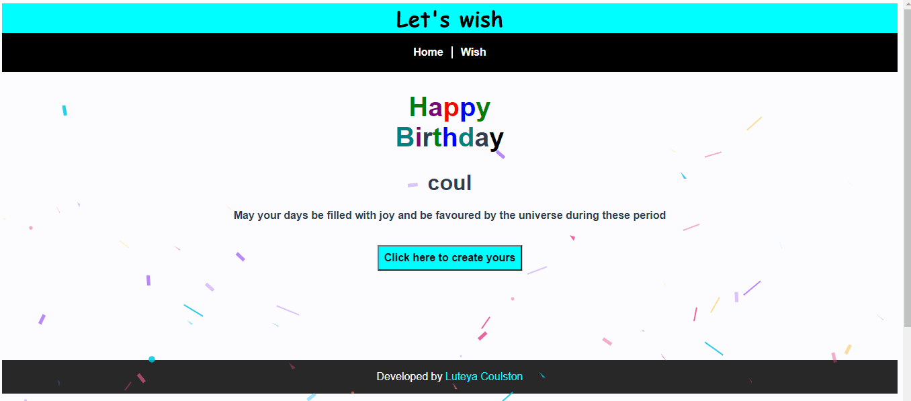

# Wishing website

## Summary
This project is made purposely for sending christmas, new year and birthday wishes digitally with your friends.
[Go to the Support Web Site to see it live](http://letswish.netlify.app/).

## Demo


## Project setup
```
npm install
```

### Compiles and hot-reloads for development
```
npm run serve
```

### Compiles and minifies for production
```
npm run build
```

### Lints and fixes files
```
npm run lint
```

### Customize configuration
See [Configuration Reference](https://cli.vuejs.org/config/).
